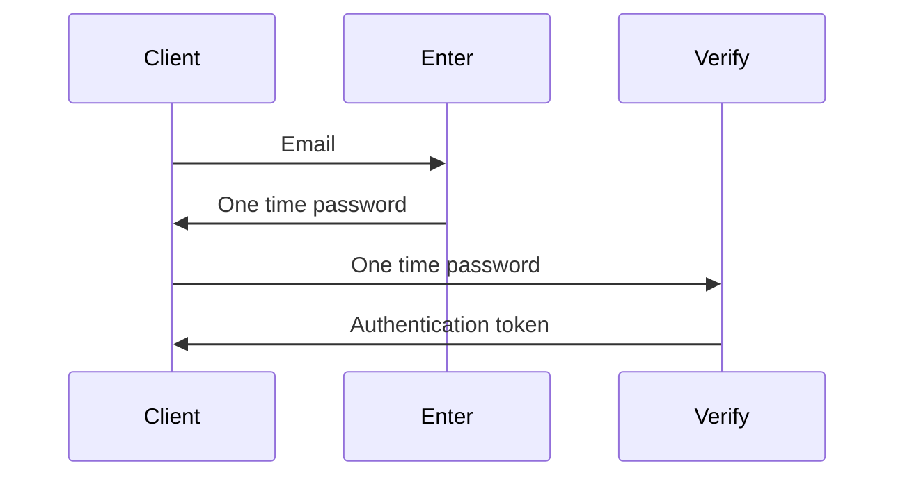

# Authentication

User can access his/her account via email, by getting a _one time password_.

```mermaid
sequenceDiagram
    participant Client
    participant Enter
	participant Verify
    Client->>Enter: Email
    Enter->>Client: One time password
    Client->>Verify: One time password
    Verify->>Client: Authentication token
```
