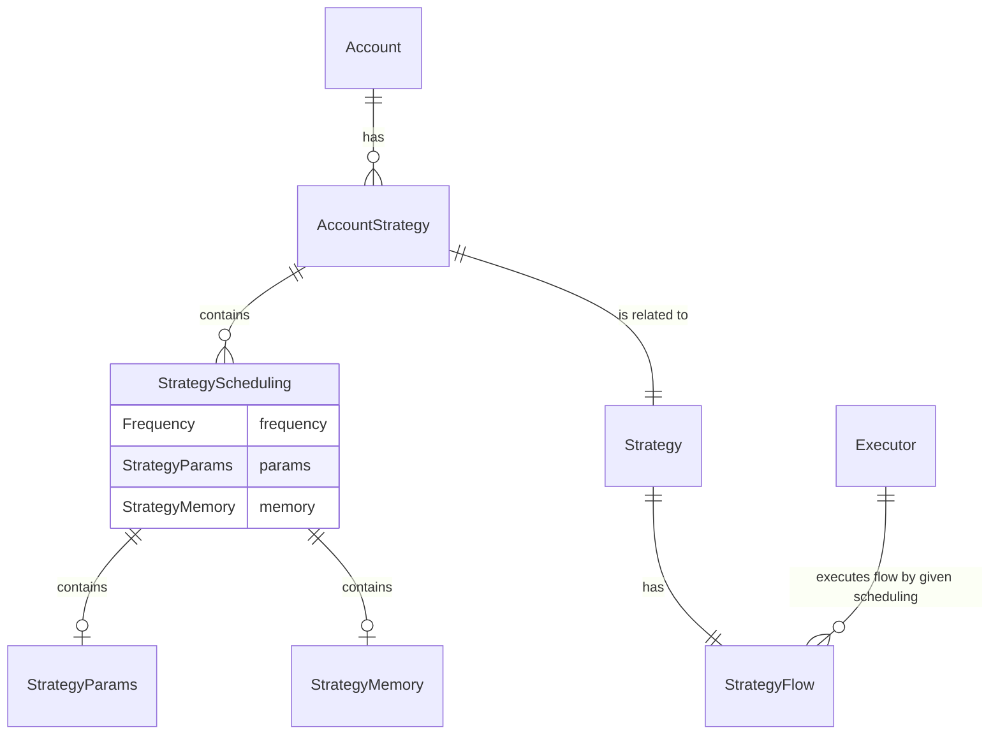

# Entity-relationship model

## Strategy execution

```mermaid
erDiagram
	StrategyScheduling {
		Frequency frequency
		StrategyParams params
		StrategyMemory memory
	}
	Account ||--o{ AccountStrategy: has
	AccountStrategy ||--o{ StrategyScheduling: contains
	AccountStrategy ||--|| Strategy: "is related to"
	Strategy ||--|| StrategyFlow: "has"
	StrategyScheduling ||--o| StrategyParams: "contains"
	StrategyScheduling ||--o| StrategyMemory: "contains"
	Executor ||--o{ StrategyFlow: "executes flow by given scheduling"
```
