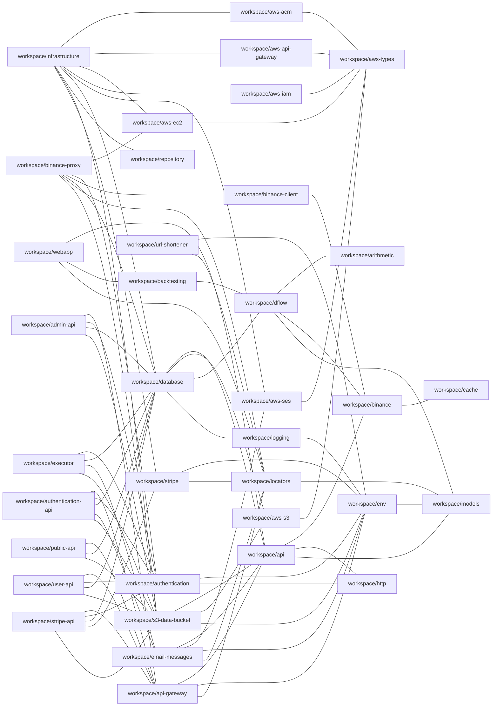

# npm dependencies

This is the internal dependencies graph: it shows how workspaces depend on each other.

```mermaid
graph LR
    workspace/admin-api --- workspace/api-gateway
    workspace/admin-api --- workspace/authentication
    workspace/admin-api --- workspace/database
    workspace/admin-api --- workspace/s3-data-bucket
    workspace/api --- workspace/binance
    workspace/api --- workspace/http
    workspace/api --- workspace/models
    workspace/api-gateway --- workspace/api
    workspace/api-gateway --- workspace/env
    workspace/api-gateway --- workspace/locators
    workspace/authentication --- workspace/env
    workspace/authentication --- workspace/http
    workspace/authentication-api --- workspace/api-gateway
    workspace/authentication-api --- workspace/authentication
    workspace/authentication-api --- workspace/database
    workspace/authentication-api --- workspace/email-messages
    workspace/authentication-api --- workspace/s3-data-bucket
    workspace/aws-acm --- workspace/aws-types
    workspace/aws-api-gateway --- workspace/aws-types
    workspace/aws-ec2 --- workspace/aws-types
    workspace/aws-iam --- workspace/aws-types
    workspace/aws-s3 --- workspace/aws-types
    workspace/aws-ses --- workspace/aws-types
    workspace/backtesting --- workspace/dflow
    workspace/binance --- workspace/cache
    workspace/binance-client --- workspace/binance
    workspace/binance-proxy --- workspace/aws-ec2
    workspace/binance-proxy --- workspace/authentication
    workspace/binance-proxy --- workspace/binance-client
    workspace/binance-proxy --- workspace/database
    workspace/binance-proxy --- workspace/locators
    workspace/binance-proxy --- workspace/s3-data-bucket
    workspace/database --- workspace/api
    workspace/database --- workspace/aws-s3
    workspace/database --- workspace/dflow
    workspace/database --- workspace/logging
    workspace/dflow --- workspace/arithmetic
    workspace/dflow --- workspace/binance
    workspace/dflow --- workspace/models
    workspace/email-messages --- workspace/api
    workspace/email-messages --- workspace/aws-ses
    workspace/email-messages --- workspace/env
    workspace/email-messages --- workspace/locators
    workspace/env --- workspace/models
    workspace/executor --- workspace/authentication
    workspace/executor --- workspace/database
    workspace/executor --- workspace/email-messages
    workspace/executor --- workspace/s3-data-bucket
    workspace/infrastructure --- workspace/aws-acm
    workspace/infrastructure --- workspace/aws-api-gateway
    workspace/infrastructure --- workspace/aws-ec2
    workspace/infrastructure --- workspace/aws-iam
    workspace/infrastructure --- workspace/aws-ses
    workspace/infrastructure --- workspace/database
    workspace/infrastructure --- workspace/repository
    workspace/infrastructure --- workspace/s3-data-bucket
    workspace/infrastructure --- workspace/stripe
    workspace/locators --- workspace/models
    workspace/logging --- workspace/env
    workspace/public-api --- workspace/api-gateway
    workspace/public-api --- workspace/database
    workspace/public-api --- workspace/s3-data-bucket
    workspace/s3-data-bucket --- workspace/api
    workspace/s3-data-bucket --- workspace/aws-s3
    workspace/s3-data-bucket --- workspace/env
    workspace/stripe --- workspace/env
    workspace/stripe --- workspace/locators
    workspace/stripe-api --- workspace/api-gateway
    workspace/stripe-api --- workspace/authentication
    workspace/stripe-api --- workspace/database
    workspace/stripe-api --- workspace/stripe
    workspace/stripe-api --- workspace/s3-data-bucket
    workspace/url-shortener --- workspace/env
    workspace/url-shortener --- workspace/locators
    workspace/user-api --- workspace/api-gateway
    workspace/user-api --- workspace/authentication
    workspace/user-api --- workspace/database
    workspace/user-api --- workspace/s3-data-bucket
    workspace/webapp --- workspace/api
    workspace/webapp --- workspace/backtesting
    workspace/webapp --- workspace/locators
```
